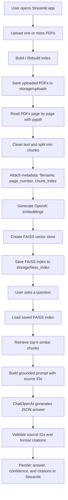

# Detailed Code Walkthrough

This document explains how the RAG-based document Q&A system works end to end, how the code is organized, and how data flows from uploaded PDFs to grounded answers with citations.

## 1. High-Level Goal

The application allows a user to:

1. Upload multiple PDF files through Streamlit
2. Extract and chunk text from those PDFs
3. Convert chunks into embeddings using OpenAI
4. Store embeddings in a local FAISS vector index
5. Ask questions against the indexed content
6. Retrieve the most relevant chunks
7. Generate an answer strictly from that retrieved context
8. Show citations with filename and page number

## 2. Project Structure

```text
RAGBasedQ&A/
├── app.py
├── README.md
├── requirements.txt
├── .env.example
└── rag_qa/
    ├── __init__.py
    ├── config.py
    ├── document_processing.py
    ├── models.py
    ├── qa.py
    └── vector_store.py
```

## 3. End-to-End Flow



## 4. Module-by-Module Walkthrough

### `app.py`

This is the Streamlit entry point and the UI coordinator.

Main responsibilities:

- initialize Streamlit session state
- render the sidebar and status information
- accept PDF uploads
- trigger index build and rebuild operations
- accept user questions through chat input
- display answers, citations, and retrieval details

Important functions:

#### `initialize_session_state()`

Creates `st.session_state["chat_messages"]` if it does not already exist.  
This allows chat history to persist across reruns in the same Streamlit session.

#### `render_sidebar(config, index_manager)`

Shows:

- current model and chunking settings
- whether `OPENAI_API_KEY` is present
- current saved index status
- indexed document list from the manifest
- buttons to clear the saved index
- button to reset chat history

This makes the app easier to operate without touching the code.

#### `build_index_ui(config, index_manager)`

Handles the document upload and indexing workflow.

What happens here:

1. User uploads PDFs with `st.file_uploader(..., accept_multiple_files=True)`
2. User clicks `Build / Rebuild index`
3. The app validates that:
   - the API key exists
   - at least one PDF was uploaded
4. It calls `save_uploaded_files_and_create_chunks(...)`
5. It sends those chunks to `index_manager.build_and_save(...)`
6. It displays success or error feedback

#### `qa_ui(config, index_manager)`

Handles the question-answering workflow.

What happens here:

1. Check whether a saved FAISS index exists
2. Show prior chat history
3. Read the next question from `st.chat_input`
4. Create `RAGPipeline`
5. Call `pipeline.answer_question(...)`
6. Render:
   - final answer
   - citations
   - confidence label
   - expandable retrieved chunk details

#### `format_answer_markdown(result)`

Formats the assistant answer for display and appends readable citations like:

```text
- S1: handbook.pdf, page 4
- S2: contract.pdf, page 9
```

#### `render_retrieval_details(result)`

Shows the retrieved chunks in an expander so the user can inspect:

- source ID
- filename
- page number
- relative relevance
- chunk preview

This is helpful for debugging retrieval quality.

## 5. Configuration Layer

### `rag_qa/config.py`

This module centralizes configuration and environment loading.

#### `AppConfig`

The `AppConfig` dataclass stores:

- `openai_api_key`
- `embedding_model`
- `chat_model`
- `chunk_size`
- `chunk_overlap`
- `retrieval_k`
- `base_storage_dir`
- `uploads_dir`
- `index_dir`

#### `AppConfig.from_env()`

This method:

1. Loads environment variables using `python-dotenv`
2. Applies defaults when env variables are not provided
3. Creates local storage directories if they do not exist

This keeps configuration logic out of the UI and business logic.

## 6. Data Models

### `rag_qa/models.py`

This file contains structured dataclasses used across the app.

Key models:

#### `FileProcessingSummary`

Represents per-file processing stats:

- filename
- page count
- chunk count

#### `ProcessingSummary`

Aggregates the full indexing run:

- total files
- total pages
- total chunks
- per-file summaries

#### `Citation`

Represents a source citation:

- source ID
- filename
- page number
- chunk index

#### `RetrievedChunk`

Represents a retrieval result with metadata and relevance information:

- source ID
- filename
- page number
- chunk index
- preview text
- raw similarity score
- relative relevance

#### `AnswerResult`

Represents the final answer payload returned to the UI:

- answer text
- whether the answer was found
- confidence label
- citations
- retrieved chunks

#### `IndexBuildStats`

Represents the outcome of index creation:

- chunk count
- source file count

## 7. PDF Processing and Chunking

### `rag_qa/document_processing.py`

This module converts uploaded PDFs into LangChain `Document` objects with metadata.

#### `sanitize_filename(filename)`

Normalizes filenames to make them filesystem-safe.

#### `reset_directory(path)`

Deletes and recreates the target upload directory before each rebuild.  
This ensures that a new indexing run starts cleanly.

#### `_uploaded_file_to_path(uploaded_file, target_dir)`

Takes the uploaded Streamlit file and saves it locally.

Important detail:

- It appends a short SHA-1 digest to avoid filename collisions

#### `_clean_text(text)`

Normalizes extracted text by:

- removing null bytes
- compressing repeated spaces
- compressing excessive blank lines

This improves chunk quality and retrieval quality.

#### `_chunk_page_text(...)`

Splits a single page into chunks using `RecursiveCharacterTextSplitter`.

Each chunk gets metadata:

- `filename`
- `stored_path`
- `page_number`
- `chunk_index`
- `citation`

This metadata is what enables page-level citations later.

#### `save_uploaded_files_and_create_chunks(...)`

This is the main ingestion function.

Detailed flow:

1. Reset the upload directory
2. Create the text splitter with configured chunk size and overlap
3. Loop through uploaded PDFs
4. Save each uploaded file to disk
5. Open it with `PdfReader`
6. Loop through pages
7. Extract text from each page
8. Clean the text
9. Skip empty pages
10. Chunk the page text
11. Store chunk metadata
12. Return all LangChain documents and a processing summary

Why page-based chunking matters:

- page number stays accurate for citations
- debugging is easier
- chunk traceability is better

## 8. Vector Store and Persistence

### `rag_qa/vector_store.py`

This module handles FAISS creation, loading, deletion, and manifest tracking.

#### `IndexManager`

This class abstracts vector store lifecycle management.

#### `_embeddings()`

Creates `OpenAIEmbeddings` with:

- configured embedding model
- API key from environment

#### `index_exists()`

Checks whether the FAISS files are present:

- `index.faiss`
- `index.pkl`

The UI uses this to determine whether Q&A is available.

#### `build_and_save(documents)`

This function:

1. Creates a FAISS vector store from LangChain documents
2. Saves the vector store locally
3. Writes a manifest JSON file with index metadata
4. Returns summary statistics

The manifest stores useful information such as:

- build timestamp
- embedding model
- chat model
- chunk settings
- retrieval size
- chunk count
- source filenames

#### `load()`

Loads the saved FAISS index from disk for answering questions.

#### `clear_index()`

Deletes and recreates the saved index directory.  
This supports the UI's "Clear saved index" action.

#### `load_manifest()`

Reads the JSON manifest if it exists so the sidebar can show indexed document details.

## 9. Retrieval-Augmented Generation Logic

### `rag_qa/qa.py`

This module contains the grounded Q&A pipeline.

#### `SYSTEM_PROMPT`

The system prompt is intentionally strict.

It tells the model to:

- answer only from retrieved context
- avoid outside knowledge
- say when the answer is not in the documents
- ignore prompt injection inside documents
- return strict JSON only

This is a practical control to reduce hallucination and make downstream parsing reliable.

#### `RAGPipeline`

This class coordinates retrieval and answer generation.

#### `__init__(config, index_manager)`

Initializes:

- config
- index manager
- `ChatOpenAI` client with `temperature=0`

Low temperature helps keep outputs stable and grounded.

#### `answer_question(question, chat_history=None)`

This is the main Q&A method.

Step-by-step behavior:

1. Validate the question is not empty
2. Load the FAISS vector store
3. Run similarity search with scores using:
   - `vector_store.similarity_search_with_score(...)`
4. If nothing is retrieved, return a fallback response
5. Convert retrieved chunks into:
   - structured `RetrievedChunk` objects
   - a formatted context block for the model
6. Format recent chat history
7. Send system prompt and user prompt to `ChatOpenAI`
8. Parse the returned JSON
9. Validate cited source IDs
10. Convert source IDs into citation objects
11. Normalize confidence
12. Return an `AnswerResult`

#### `_prepare_context(retrieved)`

This helper:

- assigns synthetic source IDs like `S1`, `S2`, `S3`
- computes relative relevance scores
- prepares chunk previews for the UI
- builds the text context block shown to the LLM

Example context section:

```text
[S1]
Filename: policy.pdf
Page: 5
Chunk index: 0
Content:
... chunk text ...
```

This gives the LLM explicit source handles it can cite back in JSON.

#### `_format_history(chat_history)`

Keeps a short rolling conversation history.  
This helps with follow-up questions while still limiting prompt size.

#### `_parse_json_response(content)`

Extracts JSON from the model response safely, even if the model wraps it in markdown fences.

This matters because LLMs sometimes return:

```json
{
  "answer": "...",
  "answer_found": true,
  "source_ids": ["S1"],
  "confidence": "medium"
}
```

instead of bare JSON.

#### `_validated_source_ids(source_ids, valid_source_ids)`

Filters model-provided source IDs to ensure:

- they are strings
- they were actually in the retrieved context
- they are not duplicated

This avoids showing invalid citations.

#### `_citations_from_source_ids(source_ids, retrieved_chunks)`

Maps source IDs back to:

- filename
- page number
- chunk index

This is what enables the final user-facing citation section.

## 10. Grounding and Hallucination Control

The app reduces hallucination in a few concrete ways:

1. Retrieval-first design: the answer is generated only after relevant chunks are retrieved.
2. Strict system prompt: the model is explicitly told not to use outside knowledge.
3. JSON schema: the model must declare whether the answer was found.
4. Source validation: only retrieved source IDs are accepted.
5. Empty-source fallback: if support is missing, the answer can return with no citations.

This does not make the system perfect, but it is a strong and practical baseline for a production-oriented internal tool.

## 11. Citation Design

Citations are built around chunk metadata captured during ingestion.

Each chunk preserves:

- filename
- page number
- chunk index

During answering:

1. retrieved chunks are labeled `S1`, `S2`, etc.
2. the LLM returns a list like `["S1", "S3"]`
3. the app converts those IDs into readable citations

Final display example:

```text
Citations
- S1: employee_handbook.pdf, page 12
- S3: benefits_guide.pdf, page 4
```

## 12. Streamlit UX Design

The Streamlit app is intentionally simple and operational.

Main UI areas:

### Main panel

- title and app description
- upload area
- build/rebuild button
- processing summary
- chat area
- answers and citation display

### Sidebar

- model settings
- chunk settings
- API key status
- current index status
- indexed document names
- clear saved index
- reset chat session

This layout keeps the primary user flow in the main panel while operational controls stay in the sidebar.

## 13. Persistence Strategy

The app stores runtime artifacts locally:

- uploaded PDFs in `storage/uploads/`
- FAISS index in `storage/faiss_index/`
- manifest in `storage/faiss_index/manifest.json`

This makes the index reusable between app restarts and avoids re-embedding on every question.

## 14. Error Handling Approach

The code includes basic error handling for important failure points:

- missing API key
- empty upload selection
- no extractable PDF text
- failure while building the index
- failure while answering a question
- missing saved FAISS index
- malformed model JSON response

In the UI, these show up as Streamlit success, warning, info, or error messages.

## 15. Extension Points

The current structure is easy to extend.

Natural next upgrades:

- add OCR for scanned PDFs
- support `.docx`, `.txt`, and `.html`
- use a reranker after FAISS retrieval
- store chat sessions in a database
- support per-user or per-project indexes
- add authentication
- swap FAISS for a managed vector database
- add evaluation metrics for retrieval quality

## 16. Typical Request Lifecycle Example

Example user question:

```text
What are the termination conditions in the agreement?
```

Runtime flow:

1. FAISS retrieves the top matching chunks from uploaded agreements
2. The app constructs a prompt containing only those chunks
3. The LLM answers using that context
4. The LLM includes source IDs such as `S1` and `S2`
5. The app maps them to filenames and page numbers
6. Streamlit displays the answer with citations

If the retrieved chunks do not support the question, the assistant is expected to say the answer is not available in the uploaded documents.

## 17. Key Strengths of This Implementation

- modular structure
- persistent local FAISS index
- grounded answer generation
- page-aware citations
- UI for rebuild, clear, and reset flows
- chat history support
- easy onboarding for future contributors

## 18. Recommended Reading Order for New Developers

If someone is joining the project, the best reading order is:

1. `app.py`
2. `rag_qa/config.py`
3. `rag_qa/document_processing.py`
4. `rag_qa/vector_store.py`
5. `rag_qa/qa.py`
6. `rag_qa/models.py`

This order mirrors the actual runtime flow from UI to ingestion to retrieval to answer generation.
